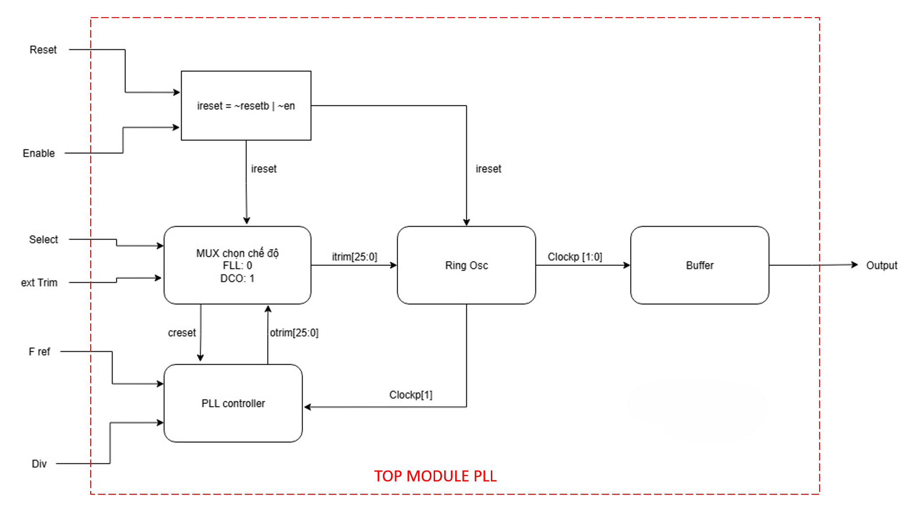
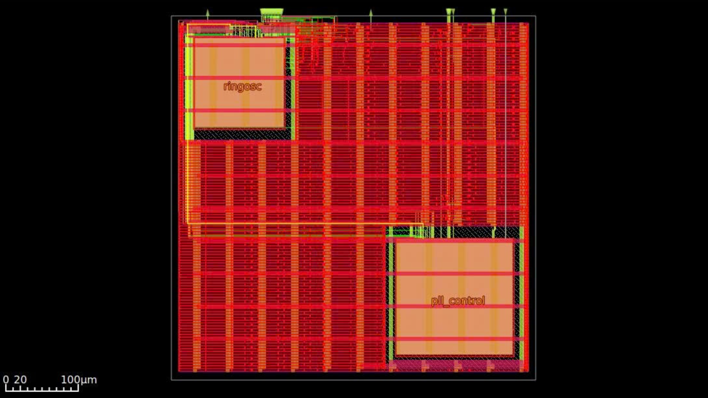

# Digital PLL

This project implements a **Digital Phase-Locked Loop (DPLL)** — technically a Frequency Locked Loop (FLL) — targeting the **GlobalFoundries 180nm** technology node using the OpenROAD open-source flow.

## Origin & Credits

The RTL for this project is inherited and developed based on the Digital PLL module from **Efabless Caravel**.

> **[Efabless Caravel](https://github.com/efabless/caravel):** Caravel is a standard SoC template with on-chip resources to control and read/write operations from a user-dedicated space.

**Note:** This is a specific IP Core Physical Implementation derived from the aforementioned RTL, refined and re-configured to operate specifically on the GF180MCU process using its standard cell libraries.

---

## Architecture & Layout

### Architecture Diagram


### Layout Result (GDS View)
Below is the GDS layout image after completing the OpenROAD flow:



---

## Project Structure

* **RTL/**: Original Verilog/SystemVerilog source code
* **tb/**: Testbench files
* **sim/**: Simulation environment using Icarus Verilog
* **back_anotation/**: Back-annotation simulation
* **openroad/**: Physical Design environment
    * `blocks_method/`: Block-based PNR method
    * `hierarchy_method/`: Hierarchical PNR method
---

## Tool Setup

This project requires the following tools:

- **Icarus verilog**: For RTL simulation
- **Gtkwave**: For viewing waveform
- **Openroad**: For physical design (synthesis, place & route)
- **Yosys**: For logic synthesis
- **GF180mcuc PDK**: GlobalFoundries 180nm process design kit
- **Klayout**: For viewing GDS layouts
- **Questasim 2022.2**: For back anotation simulation

You can use conda environment in Linux or WSL to install these tools (except Questasim because this is commercial tool):

- Install miniconda, software and library for simulation

```bash
wget -c https://repo.continuum.io/miniconda/Miniconda3-latest-Linux-x86_64.sh
bash ./Miniconda3-latest-Linux-x86_64.sh -p $HOME/eda-env -b -f
source $HOME/eda-env/bin/activate
conda install -c unic-cass iverilog openroad yosys open_pdks.gf180mcuc
```

- Make sure you have PyYAML installed. If not, install it by running:

```bash
pip install pyyaml
```

- Clone the repository

```bash
git clone https://github.com/pvc2k5/Digital-PLL
```

- Set up the environment variable `PDK_ROOT` and `PROJECT_ROOT`

```bash
cd Digital-PLL
git submodule update --init --recursive
source env.sh
```

---

## OpenROAD-flow-scripts Configuration

Since the default OpenROAD flow scripts are often configured for **9-track**, while this design requires **7-track** for GF180MCU, you must run the provided automation script.

### Run Auto-Configuration

This script automatically modifies configuration files (`config.mk`, `cells_adders.v`, `cells_latch.v`) to the correct 7-track mode and points to the correct `.lib.gz` libraries for all process corners (BC/WC/TC).

```bash
cd $PROJECT_ROOT/openroad
chmod +x setup_gf180.sh
./setup_gf180.sh
```

If you see the message **"Done"**, the configuration is complete. This script will automatically configure both the `blocks_method` and `hierarchy_method` OpenROAD-flow-scripts directories with the correct 7-track settings and corner configurations.

---

## Simulation

Use iverilog and Make to verify functionality:

- Run all testbenches:

```bash
cd $PROJECT_ROOT/sim
make
```

- Run a specific testbench:

```bash
cd $PROJECT_ROOT/sim
make <testbench_name>
```

- View waveform using gtkwave:

```bash
gtkwave <testbench_name>.vcd
```

---

## Physical Design (OpenROAD Flow)

The project supports physical implementation using OpenROAD flow. Ensure you have set up the environment before running.

### Run Place and Route

```bash
cd $PROJECT_ROOT/openroad
make
```

---

## Viewing GDS Files

After completion, you can view the GDS layout using the following methods:

### Using OpenROAD Flow Scripts GUI

```bash
cd $PROJECT_ROOT/openroad/
make gui
```

### Using KLayout

```bash
cd $PROJECT_ROOT/openroad/results/gf180/pll/base
klayout 6_final.gds
```

---

## License

This project is licensed under the **Apache License 2.0**.
